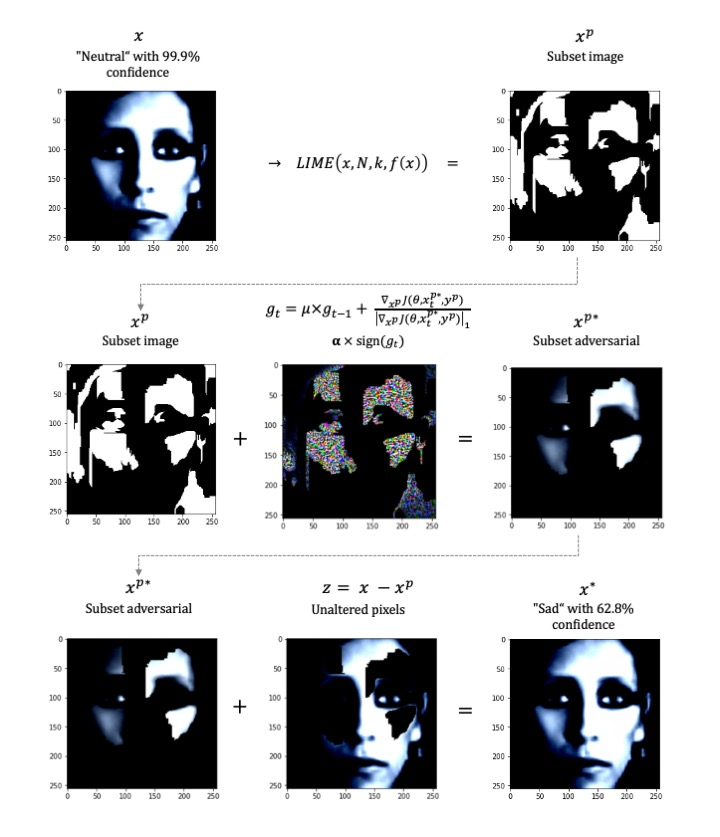

# Certainty-Attacks
This repo shows the code for our paper "Certainty attacks using explainability preprocessing". We show that metrics such as certainty that are often used for adversarial attack detection can be easily manipulated by incorporating even simple XAI techniques.


In each file you will find a small description of what is the output of the file, for the functions_file.py the functions concerning the new strategy have as well a small description of what they do. 

1) First read the functions_file.py to get an understanding of all the functions and transformations needed for the new strategy, the models, and the remaining strategies
2) Read the success_confidence_deepf_newstg.py file and generate a small test, this is the first file you always needs to run in all tests since this produces the correct_predictions file that is used in the transferability and quality of images tests
3) Run afterwards the file success_confidence_fgsm_bim to produce the results of these strategies
4) Run the two tests about quality
5) Read the transferability_all.py file and run the test of transferability after you have loaded all test models that you will use as a target and write this down accordingly in the .py file under the variable models_to_test for each data set that you have

In the folder results you will find the generated csv from the .py files (except transferability) doing a small test using the following parameters:  

FOR success_confidence_deepf_newstg (use same parameters in the other files as well)
model to load with .pt extension: Resnet18_model_JAFFE_two.pt
how many images to test: 10
how many neighbors for LIME: 1
how much decay factor for new strategy: 1
Name of dataset, can be JAFFE or FER: JAFFE


For displaying the results of the experiments:
success of each strategy is calculated as sum(label_strategy != real_label)/count(correctly classified images)
image quality of each strategy: I just took the mean value of each distance metric 
confidence: histogram with confidence of adversaries that did fool the models 
transferability: the mini code 
```
x = pd.read_csv('transferability_from_Resnet18_model_two_nb_strat3.csv')
transfer_strat = list(x.columns[8:])
dict_transfers = {}
for i in transfer_strat:
    dict_transfers[i] = len(x[x[i] != x['real_label']])/len(x)

print(dict_transfers)
```
#Visualization of the Attack Strategy



